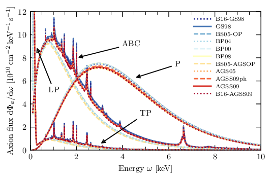

# Solar Axion Flux

<em>A C++/Python library for calculating the solar axion flux using different solar models and opacity codes.</em>

Developers: Sebastian Hoof, Lennert Thormaehlen\
Maintainer: [Sebastian Hoof](mailto:s.hoof.physics@gmail.com)\
License: Mostly BSD 3-clause license, see [LICENSE](LICENSE) for details.

### Table of Contents
 - [Results](#results) - Find out what exciting physics can be done with our library
 - [Installation](#installation) - How to install our code
 - [Get started](#get-started) - Learn how to use our code
 - [How to cite](#how-to-cite) - Guide to acknowledging this work in the literature
 - [Troubleshooting](#troubleshooting) - We summaried a few solutions for potential issues with the installation here

## Results

### Uncertainties of the solar axion flux

In &ldquo;Quantifying uncertainties in the solar axion flux and their impact on determining axion model parameters.&rdquo; we study uncertainties associated with axion-photon and axion-electron interactions.

  

The plot above shows the solar axion fluxes from ABC, longitudinal plasmon&nbsp;(LP), Primakoff&nbsp;(P), and transverse plasmon&nbsp;(TP) interactions as a function of energy, using Opacity Project data and the various solar models available in the code.

  

We used Monte Carlo&nbsp;(MC) simulation to calculate the flux for two representative solar models; the AGSS09 and GS98 models as representative choices for photospheric and helioseismological solar models, respectively. The plot above shows the (normalised) mean values and standard deviations for ABC&nbsp;(right) and Primakoff&nbsp;(P; left) interactions. The grey bands illustrate the MC noise from 100 randomly chosen MC spectra.

### Revision of solar axion flux from axion-nucleon interactions

Calculations of the axion flux from nuclear transitions were added later.

### Axions as solar thermometers

  

We then studied how to infer the solar temperature (and Debye screening scale) at different locations inside the Sun by inverting the helioscope &ldquo;axion image.&rdquo;
The [python/](python/) folder contains the related Python scripts.

## Installation

### Requirements

-  C++11 compliant compiler
-  CMake v3.12 (or higher)
-  GSL library v2.3 (or higher)
-  Optional dependencies:
   - Python interpreter v3.9 (or higher)
   - pybind11 v2.10.4 (will be automatically downloaded during CMake install)
   - Python packages: cython, iminuit, matplotlib, mpi4py, numpy, scipy

### Step-by-step guide

1. Install CMake (if necessary)
   - On Mac OS: use e.g. [Homebrew](https://brew.sh) to install CMAKE via `brew install cmake`.
2. Install the GSL library (if necessary)
   - On Mac OS: use e.g. [Homebrew](https://brew.sh) to install the GSL library via `brew install gsl`.
   - On Linux: use `sudo apt-get install libgsl-dev` instead.
   - If you don't have admin privileges on either operating system, you need to [install the GSL library from source](https://www.gnu.org/software/gsl/).
3. Clone this repo via `git clone https://github.com/sebhoof/SolarAxionFlux [foldername]`, where `[foldername]` can be replaced by a folder name of your choice.
4. Use the latest `master` branch (no need to do anything) or checkout a tagged version as a new branch (e.g. `git checkout v0.8b -b [some_branch_name]`).
5. Set up a directory via `cd [foldername]`, `mkdir build`, and `cd build/`.
6. In most cases `cmake ..` and then `make` should build everything. If this fails, consult the [Troubleshooting](#troubleshooting) section.

To validate your installation, you may use the `test_library` executable in the `bin/` folder to run a simple test program.
If you installed the Python frontend, you can also run this test from a Python terminal or notebook via `from lib import pyaxionflux as afl` (assuming you are in `[foldername]` or added `[foldername]` to your `PYTHONPATH` variable) and `afl.test_module()`. In either case, the output can be found in the `[foldername]/results/` folder.

## Get stared
We include the simple Jupyter notebook [examples.ipynb](examples.ipynb), which demonstrates a few of the capabilities available through the Python frontend (needs to be installed).

Alternatively, the `test_library` executable in the `bin/` directory runs a simple test program.

## How to cite

**All references mentioned below are can be found in the [references.bib](references.bib) file.**
You may also consider using the [BibCom tool](https://github.com/sebhoof/bibcom) to generate a list of references from the arXiv numbers or DOIs.

If you wish to *only* cite our code, we still ask you to cite [[arXiv:2101.08789]](https://arxiv.org/abs/2101.08789) and link to this Github repo.
Suffice to say that, sadly, paper citations are still viewed as more important than code citations.

Depending on what parts of the code or repository you use, more works have to be acknowledged.
We re-distribute adjusted solar models and opacity tables, detailed below.
We also include (with permission) a modified version of code by Alex Geringer-Sameth.
These routines to to compute spherically symmetric functions over a grid of square pixels are contained in `python/grid_integrator/grid_integrator.py` and are excluded from the license.
You must not re-distribute these routines without contacting us until this notice is removed!
### Specific instructions for our code

* If you do anything with this code: [[arXiv:2101.08789]](https://arxiv.org/abs/2101.08789)

* If you use the flux from nuclear transitions: [[arXiv:2111.06407]](https://arxiv.org/abs/2111.06407)

* If you use the Python scripts related to the inversion of the solar temperature profile (contained in the [python/](python/) folder): [[arXiv:2306.00077]](https://arxiv.org/abs/2306.00077)

### Solar models and opacity codes

The tables below show the works that should be cited when using the named of the included solar models or opacity codes.

| Solar model | Reference(s) |
| --- | --- |
| AGS05 | [[arXiv:0909.2668]](https://arxiv.org/abs/0909.2668) |
| AGSS09(met), AGSS09ph, GS98 | [[arXiv:0909.2668]](https://arxiv.org/abs/0909.2668), [[arXiv:0910.3690]](https://arxiv.org/abs/0910.3690) |
| B16-AGSS09, B16-GS98 | [[arXiv:1611.09867]](https://arxiv.org/abs/1611.09867) |
| BP98 | [[arXiv:astro-ph/9805135]](https://arxiv.org/abs/astro-ph/9805135) |
| BP00 | [[arXiv:astro-ph/0010346]](https://arxiv.org/abs/astro-ph/0010346) |
| BP04 | [[arXiv:astro-ph/0402114]](https://arxiv.org/abs/astro-ph/0402114) |
| BS05-OP, BS05-AGSOP | [[arXiv:astro-ph/0412440]](https://arxiv.org/abs/astro-ph/0412440) |

| Opacity code | Reference(s) |
| --- | --- |
| ATOMIC | [[arXiv:1601.01005]](https://arxiv.org/abs/1601.01005) | 
| LEDCOP | [APS Conf. Series **75** (1995)](https://ui.adsabs.harvard.edu/abs/1995ASPC...78...51M) | 
| OP | [[arXiv:astro-ph/0410744]](https://arxiv.org/abs/astro-ph/0410744), [[arXiv:astro-ph/0411010]](https://arxiv.org/abs/astro-ph/0411010)
| OPAS | [ApJ **754** 1 (1012)](https://doi.org/10.1088/0004-637X/745/1/10), [ApJ Suppl. Series **220** 1 (1015)](https://doi.org/10.1088/0067-0049/220/1/2) |

## Troubleshooting
Note that some fixes require running `make clean` or deleting the contents of your `build/` directory in order to take effect/be recognised by the CMAKE system.
* "I get some compiler related error." Try specifying the compiler that you want to use via `cmake -D CMAKE_CXX_COMPILER=[compiler executable name or path] ..`
* "CMAKE can't find the GSL library." You can give CMAKE a hint of where to find the desired version of the GSL library via `GSL_ROOT_DIR=[path to GSL folder] cmake ..`
* "I get some pybind11 error during CMAKE." Usually, there are multiple Python versions installed (by the system, package managers, virtual environments, ...), which are likely to be the root of the problem. Check that CMAKE recognises the desired Python version that you want to use. You man need to install `cython` via `pip`. The Python frontend can be disable via `cmake -D PYTHON_SUPPORT=OFF ..`.
* "I managed to build the Python library, but I can't run the test." The name of the library in the `lib/` folder (e.g. `pyaxionflux.cpython-38-darwin.so`) which indicates the Python version used to build it (in this case: Python 3.8). This might help to identify the appropriate Python executable on your system. Some environment managers may alter/obscure environment variables like `PATH` or `PYTHONPATH` and the import may fail. Check this via e.g. `echo ${PATH}` etc. or make sure that you are in the same folder as `pyaxionflux.cpython-38-darwin.so` or a soft link to it. 
