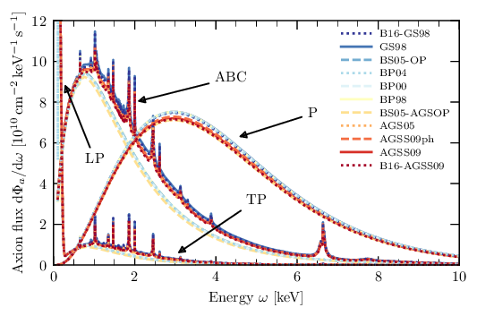
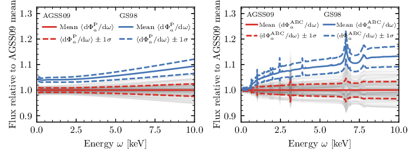

# Solar Axion Flux

<em>A C++ library and Python frontend for calculating the solar axion flux for different solar models and opacity codes.</em>

Developers: Sebastian Hoof, Lennert Thormaehlen
 Maintainer: [Sebastian Hoof](mailto:s.hoof.physics@gmail.com) 

Information on **how to acknowledge this work** in the literature can be found under [References](#references).

This code was published under the BSD 3-clause [LICENSE](LICENSE).

## Results

### Uncertainties of the solar axion flux
Our study &ldquo;Quantifying uncertainties in the solar axion flux and their impact on determining axion model parameters.&rdquo; was published in [JCAP](https://doi.org/10.1088/1475-7516/2021/09/006), and is also available on the [arXiv](https://arxiv.org/abs/2101.08789). Here we studied the uncertainties associated with axion-photon and axion-electron interactions.

  

The plot above shows the solar axion fluxes from ABC, longitudinal plasmon&nbsp;(LP), Primakoff&nbsp;(P), and transverse plasmon&nbsp;(TP) interactions as a function of energy, using Opacity Project data and the various solar models available in the code.

  

We used Monte Carlo&nbsp;(MC) simulation to calculate the flux for two representative solar models; the AGSS09 and GS98 models as representative choices for photospheric and helioseismological solar models, respectively. The plot above shows the (normalised) mean values and standard deviations for ABC&nbsp;(right) and Primakoff&nbsp;(P; left) interactions. The grey bands illustrate the MC noise from 100 randomly chosen MC spectra.

### Revision of solar axion flux from axion-nuclear interactions

Calculations of the axion flux from nuclear transitions were added later, published in the [EPJC]( 	
https://doi.org/10.1140/epjc/s10052-022-10061-1) and also available on the [arXiv](https://arxiv.org/abs/2111.06407).

### Axions as solar thermometers

We then studied how to infer the solar temperature (and Debye screening scale) at different locations inside the Sun by inverting the helioscope &ldquo;axion image.&rdquo;
The folder [python/](python/) contains the Python scripts used in the related preprint, which is available on the [arXiv](https://arxiv.org/abs/2306.00077).

## Installation

### Requirements
The code is written in C++ and requires the GSL library (v2.3 or higher) for compilation. Optionally, if you want to build Python wrappers with pybind11, you also need Python v3.x and cython. The compiler must support the C++11 standard.

### Steps
To install and test the code, follow these steps:

1. Install CMAKE (v3.12 or higher) if you don't have it already.
   - On Mac OS: use e.g. [Homebrew](https://brew.sh) to install CMAKE via `brew install cmake`.
2. Install the GSL library.
   - On Mac OS: use e.g. [Homebrew](https://brew.sh) to install the GSL library via `brew install gsl`.
   - On Linux: use `sudo apt-get install libgsl-dev` instead.
   - If you don't have admin privileges on either operating system, you need to [install the GSL library from source](https://www.gnu.org/software/gsl/).
3. Clone this repo via `git clone https://github.com/sebhoof/SolarAxionFlux [foldername]`, where `[foldername]` can be replaced by a folder name of your choice.
4. Use the latest `master` branch (no need to do anything) or checkout a tagged version as a new branch (e.g. `git checkout v0.8b -b [some_branch_name]`).
5. Set up a directory via `cd [foldername]`, `mkdir build`, and `cd build/`.
6. In most cases `cmake ..` and then `make` should build everything. If this fails, consult the [Troubleshooting](#troubleshooting) section.

To validate your installation, you may use the `test_library` executable in the `bin/` folder to run a simple test program.
If you installed the Python frontend, you can also run this test from a Python 3 terminal or notebook via `from lib import pyaxionflux as afl` (assuming you are in `[foldername]` or added `[foldername]` to your `PYTHONPATH` variable) and `afl.test_module()`. In either case, the output can be found in the `[foldername]/results/` folder.

## How to get started
We include the simple Jupyter notebook [examples.ipynb](examples.ipynb), which demonstrates a few of the capabilities available through the Python frontend (needs to be installed).

Alternatively, the `test_library` executable in the `bin/` directory runs a simple test program.

## References

We re-distribute (in adjusted form) solar models and opacity tables, which should be acknowledged appropriately using the references stated below.
We also include (with permission) a modified version of code by Alex Geringer-Sameth to compute spherically symmetric functions over a grid of square pixels. These routines are contained in `python/grid_integrator/grid_integrator.py`, and you may not re-distribute these routines without contacting us. We will adjust the repo structure and license conditions once these routines are published elswhere under a specific license.

We also provide the BibTeX file [references.bib](references.bib), which includes a collection of all relevant references.
You may also consider using the [BibCom tool](https://github.com/sebhoof/bibcom) to generate the list of references.

### Our code and results

When you make use of our code, please **link to this Github project** and cite [arXiv:2101.08789](https://arxiv.org/astro-ph/abs/2101.08789) (BibTeX entries available from e.g. [ADS](https://ui.adsabs.harvard.edu/abs/2021JCAP...09..006H/exportcitation) or [INSPIRE](https://inspirehep.net/literature/1842437), or [references.bib](references.bib)).

* If you use the flux from nuclear transitions, please also cite [arXiv:2111.06407](https://arxiv.org/astro-ph/abs/2111.06407) (BibTeX entries available from e.g. [ADS](https://ui.adsabs.harvard.edu/abs/2022EPJC...82..120D/exportcitation), [INSPIRE](https://inspirehep.net/literature/1967014), or [references.bib](references.bib)).

* If you use the Python scripts contained in [python](python/), please also cite our arXiv preprint (TBA).

### Solar models

* BP98 [arXiv:astro-ph/9805135](https://arxiv.org/astro-ph/abs/astro-ph/9805135)
* BP00 [arXiv:astro-ph/0010346](https://arxiv.org/astro-ph/abs/astro-ph/0010346)
* BP04 [arXiv:astro-ph/0402114](https://arxiv.org/astro-ph/abs/astro-ph/0402114)
* BS05-OP, BS05-AGSOP [arXiv:astro-ph/0412440](https://arxiv.org/astro-ph/abs/astro-ph/0412440)
* AGS05 [arXiv:0909.2668](https://arxiv.org/astro-ph/abs/0909.2668)
* GS98, AGSS09(met), AGSS09ph [arXiv:0909.2668](https://arxiv.org/astro-ph/abs/0909.2668), [arXiv:0910.3690](https://arxiv.org/astro-ph/abs/0910.3690)
* B16-GS98, B16-AGSS09 [arXiv:1611.09867](https://arxiv.org/astro-ph/abs/1611.09867)

### Opacities

* LEDCOP [APS Conf. Series **75** (1995)](https://ui.adsabs.harvard.edu/abs/1995ASPC...78...51M)
* OP [arXiv:astro-ph/0410744](https://arxiv.org/astro-ph/abs/astro-ph/0410744), [arXiv:astro-ph/0411010](https://arxiv.org/astro-ph/abs/astro-ph/0411010)
* OPAS [ApJ **754** 1 (1012)](https://doi.org/10.1088/0004-637X/745/1/10), [ApJ Suppl. Series **220** 1 (1015)](https://doi.org/10.1088/0067-0049/220/1/2)
* ATOMIC [arXiv:1601.01005](https://arxiv.org/astro-ph/abs/1601.01005)

## Troubleshooting
Note that some fixes require running `make clean` or deleting the contents of your `build/` directory in order to take effect/be recognised by the CMAKE system.
* "I get some compiler related error." Try specifying the compiler that you want to use via `cmake -D CMAKE_CXX_COMPILER=[compiler executable name or path] ..`
* "CMAKE can't find the GSL library." You can give CMAKE a hint of where to find the desired version of the GSL library via `GSL_ROOT_DIR=[path to GSL folder] cmake ..`
* "I get some pybind11 error during CMAKE." Usually, there are multiple Python versions installed (by the system, package managers, virtual environments, ...), which are likely to be the root of the problem. Check that CMAKE recognises the desired Python version that you want to use. You man need to install `cython` via `pip`. The Python frontend can be disable via `cmake -D PYTHON_SUPPORT=OFF ..`.
* "I managed to build the Python library, but I can't run the test." The name of the library in the `lib/` folder (e.g. `pyaxionflux.cpython-38-darwin.so`) which indicates the Python version used to build it (in this case: Python 3.8). This might help to identify the appropriate Python executable on your system. Some environment managers may alter/obscure environment variables like `PATH` or `PYTHONPATH` and the import may fail. Check this via e.g. `echo ${PATH}` etc. or make sure that you are in the same folder as `pyaxionflux.cpython-38-darwin.so` or a soft link to it. 
